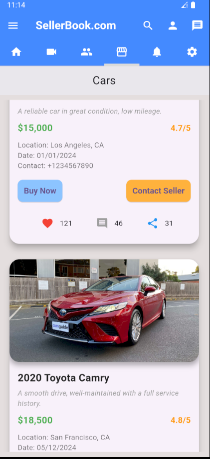
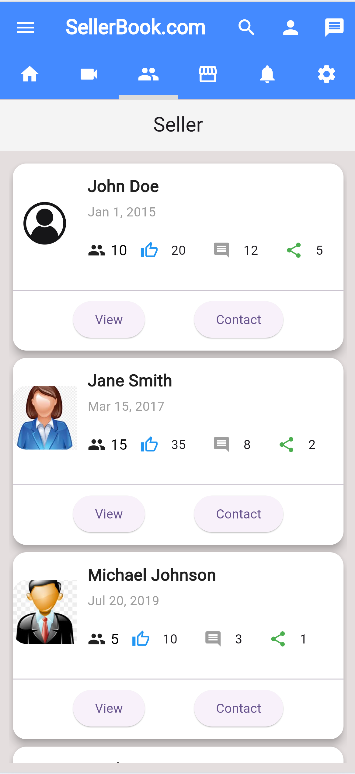
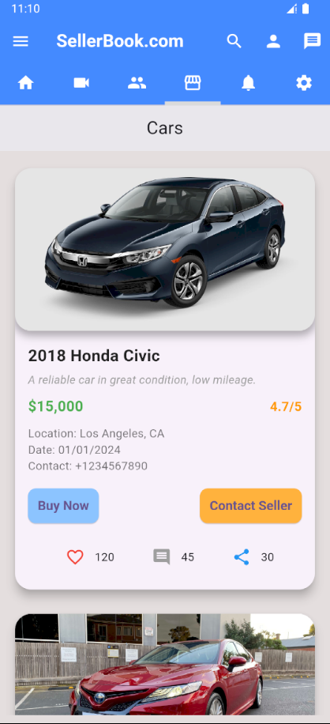
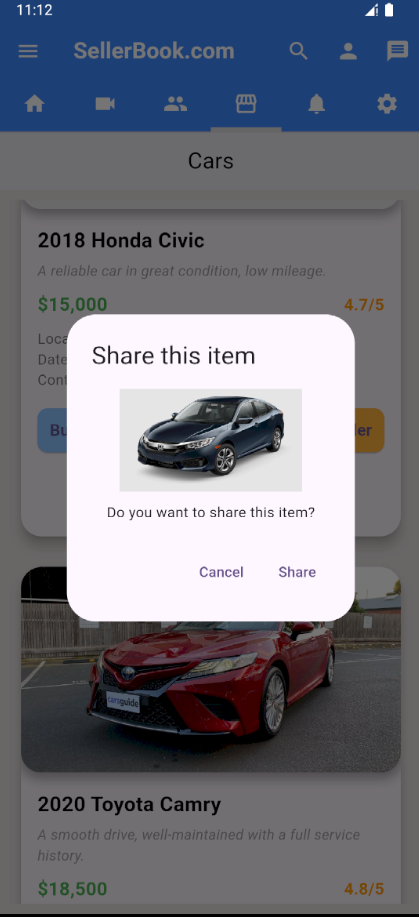
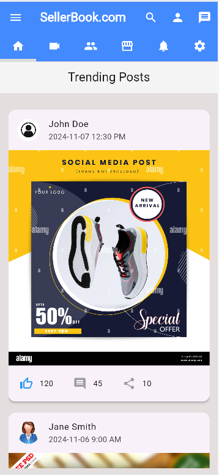

# Sales App

A simple and intuitive sales app built using Flutter that provides a seamless experience for browsing products and sellers. The app features a clean and responsive UI with pages for Home, Sellers, and Marketplace, all designed using Flutter widgets.

## Features

- **Home Page**: Provides an overview of featured products and quick access to key details.
- **Sellers Page**: Displays a list of sellers with their profiles and contact information.
- **Marketplace Page**: Showcases available products in a visually appealing card format.
- **Responsive UI**: Built with Flutter widgets to ensure a smooth experience across devices.
- **Interactive Elements**: Includes dialog boxes, product posts, and seller details for enhanced user interaction.

## Screenshots

Here are some screenshots of the app in action:

| **Marketplace Page** | **Sellers Page** | **Product Details** | **Dialog Box** | **Post Page** |
|-----------------------|-------------------|---------------------|----------------|---------------|
|  |  |  |  |  |


### Prerequisites

- **Flutter SDK**: Ensure you have Flutter installed. If not, follow the [official installation guide](https://flutter.dev/docs/get-started/install).
- **Dart**: Comes bundled with Flutter SDK.
- **IDE**: Android Studio or VS Code with the Flutter and Dart plugins installed.

### Installation

1. **Clone the repository**:
   ```bash
   git clone https://github.com/DeshanJagoda/SellingApp.git
   cd SellingApp

Feel free to modify this `README.md` to better fit your project! 🚀
